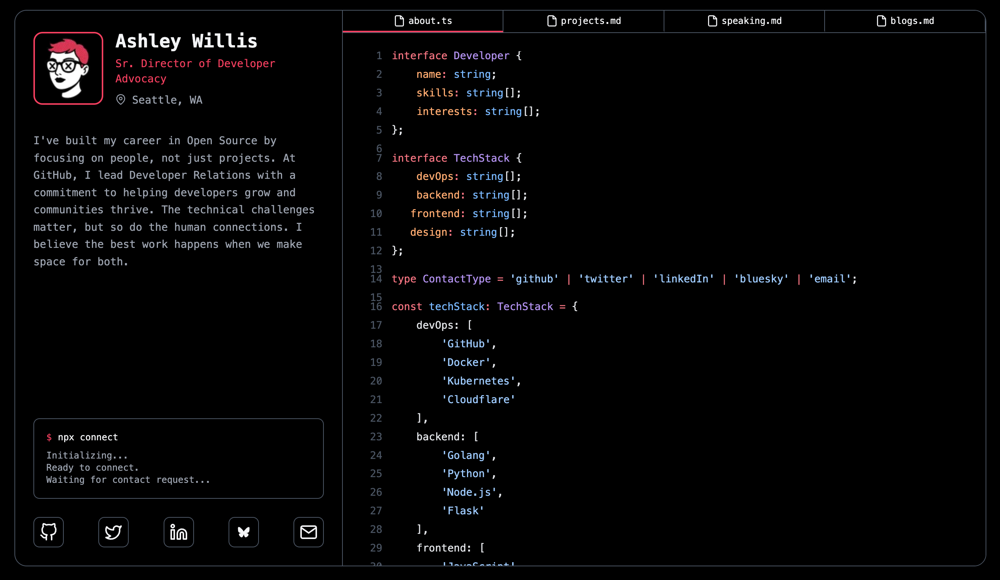

# Ashley.dev - Personal Website

This repository contains the source code for [Ashley.dev](https://ashley.dev), my personal website built with Astro and Tailwind CSS.

## 📸 Site Preview



## 🚀 Site Structure

The website consists of several key sections:
- **About** - Personal introduction and background
- **Projects** - Showcase of my key projects and contributions
- **Blog** - Articles and thoughts on various topics
- **Speaking** - Information about my speaking engagements

## 🛠️ Technology Stack

- **[Astro](https://astro.build/)** - The web framework for content-focused websites
- **[Tailwind CSS](https://tailwindcss.com/)** - A utility-first CSS framework
- **[TypeScript](https://www.typescriptlang.org/)** - Type safety for JavaScript
- **[Markdown](https://www.markdownguide.org/)** - Content management for blog posts

## ✨ Features

- Responsive design that works on desktop and mobile devices
- Content collections for structured data management
- Dark mode design for comfortable viewing
- Tag filtering system for blog posts and speaking engagements
- Social media integration with Bluesky, Twitter, LinkedIn, GitHub and Email
- Bluesky post interactions (likes and comments) displayed on blog posts
- Section-specific "no results" messaging for filtered content
- Clean URLs that don't persist query parameters on page refresh
- Robust tab system with browser history integration

## 🧞 Development Commands

All commands are run from the root of the project, from a terminal:

| Command                   | Action                                           |
| :------------------------ | :----------------------------------------------- |
| `npm install`             | Installs dependencies                            |
| `npm run dev`             | Starts local dev server at `localhost:3000`      |
| `npm run build`           | Build your production site to `./dist/`          |
| `npm run preview`         | Preview your build locally, before deploying     |
| `npm run astro ...`       | Run CLI commands like `astro add`, `astro check` |

## 📝 Content Management

Blog posts are written in Markdown and stored in `src/content/posts/`. Each post includes frontmatter with metadata such as:
- `title` - The title of the post
- `date` - Publication date
- `tags` - Categories/topics for filtering
- `blueskyPostURI` - Optional AT URI to a Bluesky post for displaying likes and comments

Speaking engagements and projects are managed through TypeScript data files in the `src/data/` directory.

## 🏗️ Project Structure

```
/
├── assets/                 # Preview images for README
├── public/
│   ├── img/                # Images used in the site
│   └── robots.txt
├── src/
│   ├── assets/             # Images used in components
│   ├── components/         # Reusable UI components
│   │   ├── BlueskyLikes.astro  # Bluesky likes and comments component
│   │   └── ...             # Other components
│   ├── content/
│   │   ├── config.ts       # Content collection configuration
│   │   └── posts/          # Blog posts in Markdown
│   ├── data/
│   │   ├── projects.ts     # Project data
│   │   └── speaking.ts     # Speaking engagements data
│   ├── layouts/
│   │   └── Layout.astro    # Main layout template
│   ├── pages/
│   │   ├── index.astro     # Homepage with tabs
│   │   └── posts/
│   │       └── [slug].astro # Dynamic blog post pages
│   ├── styles/
│   │   └── global.scss     # Global styles
│   ├── types/
│   │   └── content.ts      # TypeScript interfaces
│   └── utils/
│       └── filtering.ts    # Tag filtering utility
├── astro.config.mjs        # Astro configuration
├── tailwind.config.js      # Tailwind CSS configuration
└── tsconfig.json           # TypeScript configuration
```

## 🔄 Deployment

The site is automatically deployed when changes are pushed to the main branch.

## 📄 License

This project is licensed under the terms specified in [LICENSE.md](LICENSE.md).
